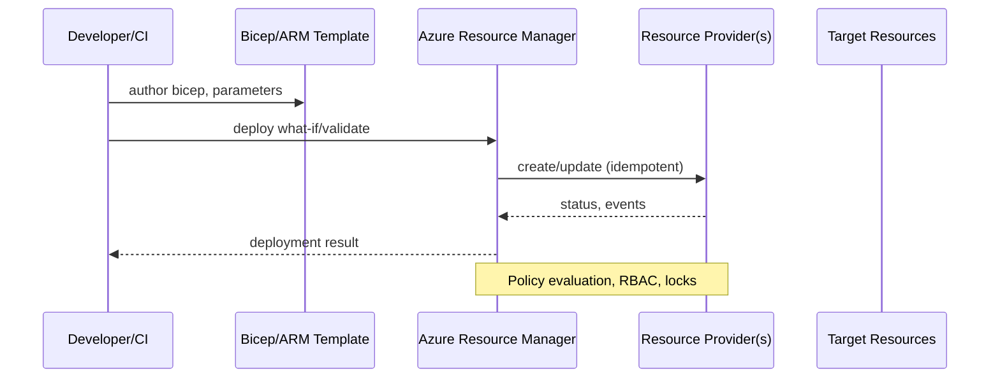
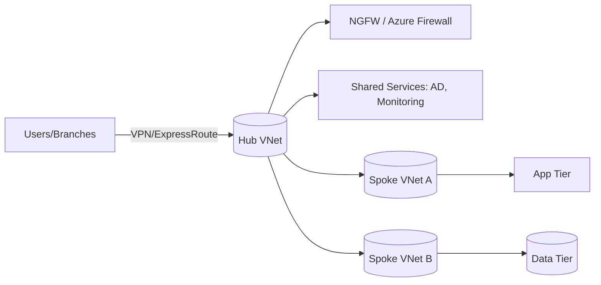

# Chapter 1 — Getting Started with Azure (Expert Guide)

> Audience: Architects and senior engineers designing cloud-native and hybrid solutions on Microsoft Azure
> Updated context: Azure services and guidance evolve quickly; validate service capabilities and SLAs as of your deployment date

---

## 1) Cloud Computing: Context and Principles

- Historical arc: From mainframes → client-server → virtualization → IaaS → PaaS → serverless → edge; Azure matured from 2008 (“Windows Azure”) to a hyperscale platform spanning 60+ regions
- Essential properties:
  - On-demand self service, broad network access, resource pooling, rapid elasticity, measured service
  - Shared responsibility model: cloud provider vs customer (varies by IaaS/PaaS/SaaS)
- Economic principles:
  - CapEx→OpEx, utilization smoothing, economies of scale, spot/preemptible capacity, reserved instances, autoscaling
- Architectural tenets:
  - Loose coupling, stateless compute, idempotent operations, eventual consistency, defense in depth, policy-as-code, automation-first

## 2) Deployment Paradigms in Azure

- IaaS: VMs, disks, VNets, NSGs, Load Balancers; pros: full control; cons: ops burden
- PaaS: App Service, Azure SQL, AKS (managed control plane), Functions; pros: velocity; cons: platform constraints
- Serverless: Functions, Logic Apps, Event Grid; pros: event-driven scale-to-zero; cons: cold-start, observability nuances
- Containers: ACR, AKS, Container Apps; pros: portability, microservices; cons: cluster ops unless using managed abstractions
- Hybrid/Edge: Azure Arc, Stack HCI/Hub, Private MEC; patterns for regulatory/latency use cases

## 3) Understanding Azure and ARM (Azure Resource Manager)

- ARM is the control plane for Azure; provides idempotent, declarative deployment, RBAC, tagging, locks, and policy
- Why ARM: consistent API surface, dependency modeling, drift detection, and state convergence
- Concepts: resource providers, resource types, subscriptions, management groups, resource groups, templates (ARM/Bicep), deployments, scopes
- Advanced techniques:
  - Bicep as IaC DSL; modules for reuse; what-if deployments; template specs; secure parameters via Key Vault references
  - Cross-scope deployments (sub/mg/tenant); deploymentStacks; policy-driven deployments (DeployIfNotExists)
  - Blueprints (legacy) → Template Specs + Policy + DevOps pipelines (current practice)

## 4) Virtualization and Containers

- Virtualization: Hyper-V based hosts; VM sizing (vCPU/Memory/TempDisk), Ephemeral OS disks, Accelerated Networking, Proximity Placement Groups
- Availability sets vs zones: fault domains and update domains; zone-aware services increase resiliency
- Containers: OCI images in ACR; supply-chain security (content trust, image scanning, SBOMs)
- Docker fundamentals: build/push/pull; multi-stage builds; distroless images; least privilege (rootless where possible)

## 5) Interacting with Azure: Tooling

- Portal: RBAC-scoped access; Activity Log; Resource Graph Explorer
- Azure CLI: idempotent scripting; az deployment group/sub/mg/tenant; az graph; devcontainers
- PowerShell: Az modules; desired state with Azure Policy + Guest Configuration
- REST/SDKs: management plane vs data plane; throttling/backoff; ARM API versioning
- IaC: ARM/Bicep/Terraform; change management via PRs; environment separation (mgmt groups, subs)

## 6) ARM Templates and Bicep: Design and Governance

- Patterns:
  - Modularization and versioned Template Specs
  - Parameterization with secureString/secureObject; policy-enforced defaults
  - Outputs to wire resources across templates; copy/copyIndex for fan-out
- Edge cases:
  - Cyclic dependencies, implicit dependencies (e.g., role assignments), long-running deployments (30–60m timeouts)
  - Locks and policy conflicts; tenant-level deployment permissions
- Emerging trends: Bicep de-facto; GitHub OIDC to Azure for CI; deploymentStacks to group lifecycle; Fleet for multi-cluster

## 7) Azure as an Intelligent Cloud

- Data+AI integration: Cognitive Services, OpenAI, Synapse, Fabric; eventing via Event Grid, Service Bus; analytics via Databricks
- Zero trust: identities (Entra ID), Conditional Access, PIM, Managed Identities, Private Link, Defender for Cloud
- Observability: Azure Monitor (metrics, logs), Application Insights, Log Analytics, Workbooks, DCRs, Azure Monitor Agent

## 8) Real-World Architecture Patterns and Examples

- Multi-region active/active web app: App Service + Front Door + Traffic Manager (legacy) or FD Standard/Premium + Private Link + ACR/Key Vault; data tier via Cosmos DB (multi-region write) or SQL MI with auto-failover groups
- Event-driven ingestion: Event Hubs → Functions/Stream Analytics → ADLS Gen2 → Synapse; enforce schema with Event Schema Registry
- Hybrid landing zone: Management Groups + Policy + Arc-enabled servers/K8s; hub-spoke networking; central monitoring; identity baseline

## 9) Pros and Cons Summary

- Pros: velocity, elasticity, global reach, managed security baselines, platform SLAs
- Cons: provider limits/quotas, service fragmentation, egress costs, platform quirks (preview GA gaps), shared tenancy risks

## 10) Edge Cases and Pitfalls

- Region capacity constraints; quota increases lead time
- Zonal vs regional resource skew; ensure zone-redundant SKUs where needed
- Policy/Locks blocking deployments; tenant scope permissions
- Identity bootstrap: system-assigned vs user-assigned managed identities lifecycles

## 11) Emerging Trends

- Platform convergence around Bicep + Template Specs + Policy as primary governance
- Azure Operator Nexus and private 5G edge; Confidential Computing and TEEs; Arm-based VMs
- Sustainability metrics and carbon-aware scheduling; workload placement policies

## 12) Historical Notes

- Windows Azure → Microsoft Azure (2014 rebrand); ARM (2014+) replaced classic ASM; rise of PaaS/serverless post-2016; regions, zones expansion

## 13) Hands-on Checklist

- [ ] Deploy a Bicep module with what-if, policy assignments, and Key Vault references
- [ ] Create a zone-redundant App Service + Azure SQL with failover group
- [ ] Build a CI pipeline using GitHub OIDC to Azure with least-privileged federation
- [ ] Enable Azure Monitor (DCR) + Application Insights for a sample app

## 14) Further Reading

- Azure Well-Architected Framework (WAF) pillars
- Azure Architecture Center reference architectures
- Azure Resource Graph and governance at scale
- Bicep and ARM template specs; Deployment Stacks


---

## Diagrams

### ARM hierarchy and scope
```mermaid
flowchart TD
  T[(Tenant)] --> MG[Management Group(s)]
  MG --> SUB[Subscription]
  SUB --> RG[Resource Group]
  RG --> R1[Resource: Compute]
  RG --> R2[Resource: Network]
  RG --> R3[Resource: Data]
  classDef pol fill:#eef,stroke:#88f,stroke-width:1px;
  P1[[Policy Assignments]]:::pol --> MG
  P2[[Policy / RBAC]]:::pol --> SUB
  P3[[Tags/Locks]]:::pol --> RG
```

### ARM/Bicep deployment flow


### Hub-spoke landing zone (network)

