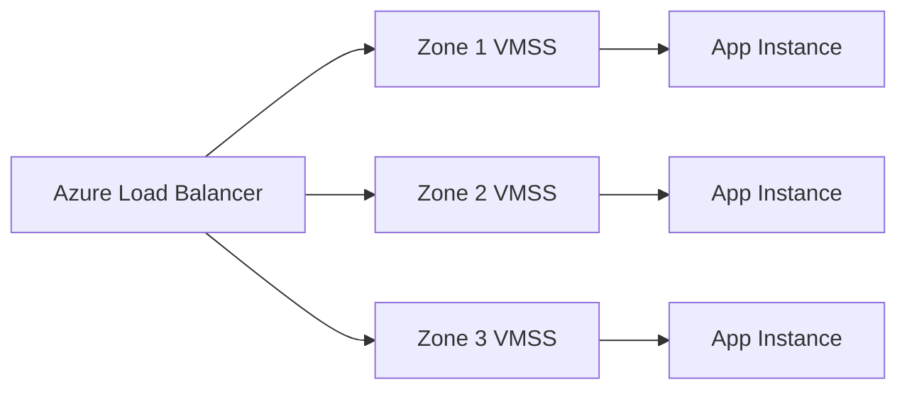
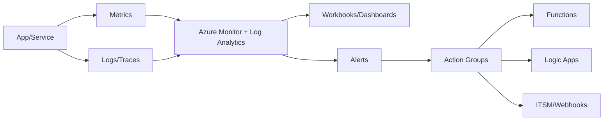

# Chapter 2 — Azure Solution Availability, Scalability, and Monitoring (Expert Guide)

> Audience: Cloud architects and SREs designing highly available and scalable systems on Azure
> Note: Verify SLAs and SKU capabilities for your target region(s); use zone-redundant options where available

---

## 1) High Availability (HA): Principles and Azure Building Blocks

- Availability vs reliability vs durability vs resilience vs recoverability — distinct but related qualities
- SLO/SLA/SLA credits: define measurable objectives (e.g., 99.9% monthly uptime); map user journeys to error budgets
- Failure domains: rack (fault domain), cluster, zone, region; avoid correlated failure by spreading across domains
- Blast radius control: compartmentalize via subscriptions, resource groups, and networking boundaries (hub-spoke)
- Eliminate single points of failure: multi-instance stateless compute; zone-redundant services; replicated data stores

### Azure HA Services and Patterns
- Zonal deployments: zone-pinned resources (e.g., zonal VMs, disks, NICs)
- Zone-redundant SKUs: ZRS storage, zone-redundant App Gateway, zone-redundant Key Vault, zone-redundant SQL
- Region-paired strategy: Azure pairs regions for DR operations and updates sequencing
- Data replication choices: GRS/GZRS for Storage; auto-failover groups for Azure SQL; multi-region writes for Cosmos DB
- Traffic distribution: Azure Front Door (global anycast), Traffic Manager (DNS-based), Application Gateway (L7), Load Balancer (L4)

### Advanced HA Design
- Active/active vs active/passive across regions; RTO/RPO trade-offs
- Health probes and synthetic monitoring; failure detection time vs failover time
- State management: session affinity vs distributed caches (Azure Cache for Redis); durable state with queues and idempotency
- Partial regional failures and brownouts; graceful degradation and feature flags

---

## 2) VM and Compute HA

- VMs: availability sets (update +
 fault domains), availability zones, proximity placement groups (latency-sensitive)
- Scale sets (VMSS): automatic instance distribution across zones; upgrade policies (automatic, rolling, manual)
- Host maintenance: Scheduled Events; use ephemeral OS disks for fast reimage; terminate notification handling
- PaaS compute: App Service (slots, autoscale, zone redundancy), AKS (multi-node pools, multiple zones), Functions (premium plans for HA)

### Patterns
- Blue/green, canary, ring deployments via slots or deployment rings
- Circuit breaker and bulkhead isolation for cascading failure protection
- Queue-based load leveling (Service Bus/Storage Queues) for spikes; backpressure via 429s and retry-after

---

## 3) Scalability: Vertical, Horizontal, Elastic

- Performance vs scalability: throughput scaling with users while maintaining SLOs
- Horizontal scale: stateless app tiers; shard stateful stores; use partitioning keys deliberately (hot shards mitigation)
- Autoscale signals: CPU/memory, queue length, custom metrics (Application Insights), schedule-based scale
- PaaS scaling specifics:
  - App Service: plan scaling, per-app scaling, zone redundancy, AlwaysOn
  - AKS: cluster autoscaler + horizontal pod autoscaler (HPA) + KEDA event-driven scaling
  - SQL Database/MI: vCore/DTU scaling; serverless auto-pause; elastic pools; Hyperscale (compute/storage separation)
  - Cosmos DB: RU/s provisioning, autoscale, multi-master; cross-region writes and consistency levels

### Anti-patterns and Edge Cases
- Sticky sessions limiting scale-out; solve with Redis or token-based state
- Noisy neighbor and throttling; apply retry with exponential backoff + jitter; respect 429/503 semantics
- Autoscale oscillation; use cooldowns, predictive autoscale, queue-based scaling signals

---

## 4) Load Balancing: L4–L7 Options and Trade-offs

- Azure Load Balancer (L4): ultra-low latency, TCP/UDP, zonal or zone-redundant; outbound SNAT considerations
- Application Gateway (L7): WAF, path-based routing, session affinity, end-to-end TLS; zone redundancy
- Azure Front Door: global anycast, split TCP, WAF, caching (with CDN), geo-filtering, origin groups, health probes
- Traffic Manager: DNS-level routing (priority, weighted, performance, geographic, subnet); TTL impacts failover time
- Design guidance: combine Front Door (global) + App Gateway (regional) + VMSS/AKS (origin) for layered resilience

---

## 5) Upgrades and Maintenance

- Platform updates: Availability sets and zones minimize impact; plan maintenance windows and SLO-friendly rollouts
- Application updates: slots (App Service), staged rollouts (AKS deployments), feature flags and dark launches
- Image updates: golden images (Packer), ephemeral OS disks + image versioning (Shared Image Gallery)
- Guest updates: Azure Update Manager/Automation for patching; maintenance configuration and compliance

---

## 6) Monitoring: Signals, Telemetry, and Action

- Telemetry taxonomy: metrics (near real-time), logs (structured/semi-structured), traces (request spans), events
- Azure Monitor: a platform for metrics + logs; DCRs (data collection rules), Azure Monitor Agent (AMA)
- App Insights: distributed tracing, sampling, live metrics, dependency tracking; Kusto Query Language (KQL)
- Log Analytics: central workspace; Workbooks; Alerts (metric + log + activity) → Action Groups → automation (Functions/Logic Apps)
- SLO monitoring: RED/USE methods; error budgets; burn rate alerts; SRE runbooks and Auto-Heal

### Advanced Practices
- Synthetic monitoring via Azure Load Testing/Playwright + containerized runners
- Correlate telemetry across services with W3C trace-context; use OpenTelemetry for standardization
- Secure observability: Private Links for ingestion, access policies, table-level RBAC; cost control via sampling, archive tiers, transformation rules

---

## 7) Architectural Considerations: Regions, Zones, and DR

- Intra-region HA: multi-zone deployments with zone-redundant SKUs
- Cross-region DR: active/active or active/passive; data replication (GZRS/RA-GZRS, SQL failover groups, Cosmos DB)
- Testing DR: game days, chaos engineering; simulate zone/region outages; validate RTO/RPO
- Compliance: data residency and sovereignty; paired-region failover policies

---

## 8) Real-World Reference Architectures

- Global e-commerce:
  - Front Door (WAF) + App Gateway + AKS/VMSS
  - Cosmos DB multi-master (bounded staleness/session), Redis cache, Event Hubs for telemetry
  - Geo-redundant storage (GZRS) with versioning and immutability for legal hold
- Fintech payments:
  - Strict SLOs, priority routing in Traffic Manager, zone-redundant SQL MI with auto-failover group
  - Private Link everywhere, managed identities, Key Vault HSM-backed keys
- Media streaming:
  - Front Door + CDN + origin shielding; premium storage with read-access geo-redundancy; event-driven autoscale

---

## 9) Pros/Cons and Trade-offs

- Pros: global reach, managed HA primitives, rich telemetry, mature scaling features
- Cons: SKU/feature variance per region, complex service combinations, hidden costs (egress, monitoring), preview → GA gaps

## 10) Edge Cases and Pitfalls

- Health probe misconfiguration causing cascading unhealthy status
- SNAT port exhaustion behind Load Balancer; use NAT Gateway or tune outbound flows
- Zonal skew and quota limits; proactively request capacity
- DNS TTL too high → slow failover; too low → resolver load and cost

## 11) Emerging Trends

- Front Door Standard/Premium unifying CDN + WAF + global LB
- Autoscale with AI/predictive models; KEDA-based scaling for event streams
- Observability: OpenTelemetry-native pipelines; log cost governance with Data Collection Rules
- Confidential computing SKUs, zonal coverage expansion

## 12) Hands-on Checklist

- [ ] Deploy multi-zone App Service + zone-redundant App Gateway + Front Door
- [ ] Configure SQL failover groups and validate failover in drills
- [ ] Instrument app with OpenTelemetry and build RED/USE dashboards in Workbooks
- [ ] Set up autoscale: AKS HPA + Cluster Autoscaler + KEDA

## 13) Further Reading

- Azure Well-Architected Framework (Reliability, Performance, Cost)
- Azure Architecture Center: HA/DR reference architectures
- Azure Monitor documentation (DCR, AMA, App Insights)
- Front Door, Traffic Manager, App Gateway, and Load Balancer docs


---

## Diagrams

### Layered global + regional load balancing
```mermaid
flowchart TB
  U[Users] --> FD[Azure Front Door (WAF, Anycast)]
  FD --> RG1[Region A]
  FD --> RG2[Region B]
  subgraph Region A
    AG1[App Gateway (WAF, L7)] --> OR1[(Origins: AKS/VMSS/AppSvc)]
  end
  subgraph Region B
    AG2[App Gateway (WAF, L7)] --> OR2[(Origins: AKS/VMSS/AppSvc)]
  end
  classDef z fill:#eef,stroke:#88f
  class RG1,RG2 z
```

### Zonal HA within a region


### Monitoring and alerting pipeline

