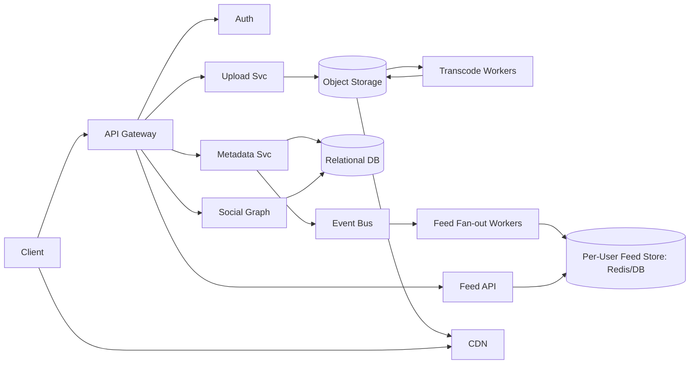
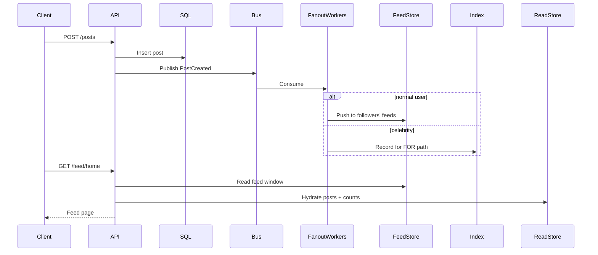

# System Design Case Study: Instagram‑like Photo Sharing

> Deep-dive but concise reference for interview prep and real-world design. Includes APIs, schema, capacity planning, caching, consistency, media pipeline, .NET Core 8 outline, and trade‑offs.

## 1) Problem Statement and Scope
Design a photo sharing platform where users can:
- Create accounts, follow others
- Upload images (with captions, tags), view feed, like/comment
- View user profiles and photo grids

Out of scope (for brevity): stories, reels, DMs, ads, full search, ML ranking.

## 2) Requirements
- Functional:
  - Post image(s) with caption; async processing and eventual appearance in feeds
  - Home feed shows followed users’ posts in reverse-chronological (baseline)
  - Like/unlike, comment; user profile photo grid
  - Pagination/infinite scroll; basic notifications (optional)
- Non-functional:
  - Scale: target 10M DAU; 4M new photos/day; 80M feed reads/day
  - Latency: p50 < 80ms, p95 < 150ms for feed reads (API only, media via CDN)
  - Availability: 99.9% API; durability for media
  - Consistency: strong for auth/metadata; eventual for feeds and counters
  - Cost aware: heavy use of CDN and caches

Back-of-envelope (example):
- Photos/day ≈ 4M; average 1MB each (after compression) → 4 TB/day → ~120 TB/month raw (before replication)
- Write QPS (posts): 4M/86,400 ≈ 46 QPS average; peaks 10× → ~500 QPS
- Feed reads QPS: 80M/86,400 ≈ 925 QPS average; peaks 20× → ~18k QPS
- Likes/comments 5× posts volume combined; hot keys exist (celeb content)

## 3) High-Level Architecture
- Mobile/Web clients
- API Gateway + Auth
- Services:
  - Media Upload Service → Object Storage (S3/GCS/Azure Blob)
  - Transcode/Processing Workers → multiple resolutions/thumbnails
  - Metadata Service (posts, users, follows) → SQL + read replicas
  - Social Graph Service (follows)
  - Feed Service (fan-out workers + per-user feed store)
  - Engagement Service (likes/comments)
  - Cache (Redis) + CDN for media; Search (optional)

Mermaid (component):


## 4) Data Model (relational core + object storage)
- users(id PK, handle UNIQUE, name, private, created_at)
- follows(user_id, follower_id, created_at) PK(user_id, follower_id) with indexes on both
- posts(id PK, user_id FK, caption, media_key, created_at, visibility)
- media_assets(id PK, post_id FK, storage_key, width, height, variant, bytes)
- likes(post_id, user_id, created_at) PK(post_id, user_id)
- comments(id PK, post_id, user_id, text, created_at)
- feed_items(user_id, post_id, score, created_at, source) PK(user_id, post_id)

Indexes: posts(user_id, created_at DESC), feed_items(user_id, created_at DESC), likes(post_id), comments(post_id, created_at)

Sharding:
- Social graph and user-centric tables by user_id
- Content-centric (likes/comments) by post_id
- Avoid hot partitions with celebrity mitigation (see feed strategy)

## 5) API Design (REST baseline)
- POST /media/uploads → start/chunked upload → returns media_key
- POST /posts → body: {media_key, caption} → returns post_id (publishes event)
- GET /feed/home?cursor=…&limit=… → returns list of posts with user, like counts
- POST /users/{id}/follow, DELETE /users/{id}/follow
- POST /posts/{id}/like, DELETE /posts/{id}/like
- GET /users/{id}/posts?cursor=…

DTO example:
```json
{
  "id": "p_123",
  "user": {"id": "u_9", "handle": "jane"},
  "caption": "Sunset!",
  "media": [{"url": "https://cdn/.../p_123_1080.jpg", "w":1080, "h":1080}],
  "likeCount": 42,
  "liked": true,
  "createdAt": "2025-08-20T10:15:00Z"
}
```

## 6) .NET 8 Minimal API Outline (+ pseudocode)
C# (shape only; focus on contracts and flow):
```csharp
var app = WebApplication.Create(args);
var feed = app.MapGroup("/feed");
feed.MapGet("/home", async (FeedService svc, string? cursor, int? limit) =>
{
    // Pseudocode: resolve userId from auth, read from per-user feed store
    // var items = await svc.GetHomeFeed(userId, cursor, limit ?? 20);
    // return Results.Ok(items);
});
var posts = app.MapGroup("/posts");
posts.MapPost("/", async (PostService svc, CreatePostDto dto) =>
{
    // Validate mediaKey, persist post metadata (SQL), enqueue event
    // await svc.CreatePost(userId, dto);
    // return Results.Created($"/posts/{id}", new { id });
});
```
Pseudocode for FeedService.GetHomeFeed:
```text
Input: userId, cursor, limit
1) key = $"feed:{userId}"; items = Redis.ZRevRangeByScore(key, cursor, limit)
2) If cache miss → fallback to DB feed_items
3) Hydrate posts from post read store; merge like counts (cached)
4) Return DTOs + next cursor
```

## 7) Feed Generation Strategies
- Fan-out on write (FOW): upon new post, push to followers’ feeds (feed_items, Redis list/sorted set). Pros: fast reads; Cons: write amplification, celebrity hot keys.
- Fan-out on read (FOR): compute/merge at read time. Pros: lower write cost; Cons: slower reads, complex ranking.
- Hybrid: default FOW for normal users; FOR for celebrities (follower count above threshold), with late materialization and caching layers.

Sequence (hybrid):


Hot key mitigation:
- Do not push celebrity posts to all followers; store once, read-merge for FOR path
- Rate-limit likes/comments to protect counters; batch fan-out for notifications

## 8) Caching and Storage
- CDN for media: cache-control, immutable URLs (content-hash), signed URLs
- Redis:
  - Per-user feed: ZSET key feed:{userId} with score=created_at/score
  - Hot counters: likeCount:post:{postId} with periodic write-back to SQL
  - User profile cache and follow lists with short TTL
- Read replicas for SQL; use CQRS-ish split read/write paths
- Search/Explore (optional): ES/OpenSearch for tags/hashtags

## 9) Media Pipeline
1) Client → Upload Service: chunked upload to staging bucket; get media_key
2) Enqueue process job → transcode into multiple sizes (e.g., 1080, 720, 480, thumb)
3) Store derivatives to object storage; write media_assets rows
4) Invalidate/prime CDN; mark post as publishable
5) POST /posts references media_key; PostCreated triggers feed fan-out

Reliability: idempotency keys for upload and post creation; checksum verification; retries with backoff.

## 10) Consistency, Availability, and Transactions
- Strong consistency where needed: user auth, follow/unfollow, post existence
- Eventual consistency acceptable:
  - Feed appearance latency (p95 < a few seconds)
  - Like/comment counts (periodic reconciliation)
- Use outbox pattern for PostCreated events to avoid dual-write anomalies
- Exactly-once not required; aim for idempotent consumers

## 11) Capacity Planning (sample numbers)
- Storage: 4 TB/day raw → with 3× replication ≈ 12 TB/day effective; lifecycle policy: move cold to cheaper storage after 30 days
- Network: assume 2 views per photo via CDN; 8 TB/day egress baseline; budget CDN hit ratio > 95%
- Compute: Fan-out workers sized for peak write bursts (celebrity storms). Use partitioned queues (by user shard) and autoscaling

## 12) Security and Privacy
- OAuth 2.1 / OIDC; short-lived access tokens; refresh tokens
- Private accounts: check follow relationship before returning media URLs
- Media access: signed URLs with short TTL; do not expose raw storage keys
- Rate limiting and bot/abuse detection; WAF; content moderation hooks
- Encryption at rest and in transit; audit logs

## 13) Observability and SLOs
- SLOs: GET /feed/home p99 < 200ms; POST /posts success rate > 99.9%
- Metrics: queue lag, fan-out latency, cache hit ratios, error budgets
- Tracing across API → workers → storage; structured logging with correlation IDs
- Runbooks: hot key incidents, queue backlog, CDN misses

## 14) Trade-offs Summary
- FOW vs FOR vs hybrid: pick hybrid
- SQL for metadata vs NoSQL: start with SQL + read replicas; re-evaluate at >100M users
- Counters in Redis vs DB triggers: counters in Redis with periodic flush
- Consistency: prefer availability and latency for feeds; reconcile in background

## 15) Interview Tips
- State assumptions; quantify traffic and data sizes
- Call out hot partitions and mitigations
- Be explicit about consistency and failure handling
- Show iterative evolution plan (MVP → scale)

## 16) Quick MCQs (answers below)
1) Which approach best handles celebrity posts at scale?
   A. Pure fan-out on write
   B. Pure fan-out on read
   C. Hybrid: FOR for celebrities, FOW otherwise
   D. Always write to every follower’s feed
2) Best storage for raw images and variants?
   A. Relational DB BLOB
   B. Object storage + CDN
   C. Local disk on API nodes
   D. In-memory cache only
3) Where to maintain like counters for fast reads and acceptable accuracy?
   A. Only in SQL
   B. Only in client state
   C. Redis hot counter + periodic SQL flush
   D. Background recompute weekly
4) Primary key for feed_items in a user-centric feed store?
   A. (post_id)
   B. (user_id)
   C. (user_id, post_id)
   D. (post_id, created_at)
5) Which pattern avoids dual-write anomalies when emitting PostCreated after DB write?
   A. 2PC
   B. Outbox pattern
   C. Cron job replay
   D. Best effort retry without idempotency

Answers: 1‑C, 2‑B, 3‑C, 4‑C, 5‑B

