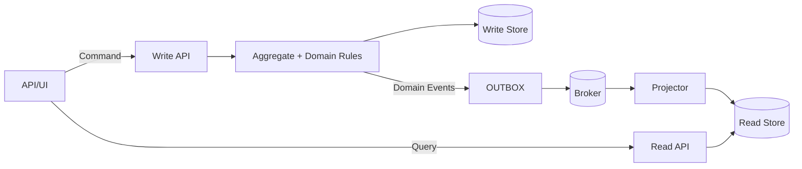
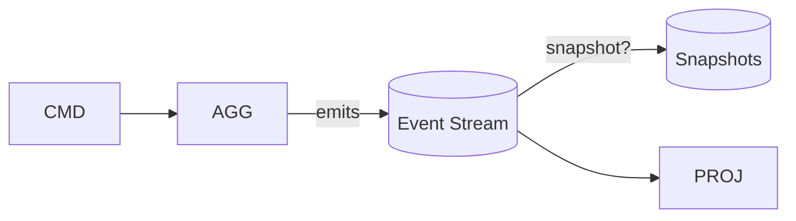

# CQRS (Command Query Responsibility Segregation) — Deep Dive for .NET 8

> Audience: Senior engineers/architects building high-scale, high-complexity domains on .NET 8 and Azure
> Goal: Practical, expert-level guidance with code + pseudocode, architecture diagrams, pros/cons, and edge cases

---

## 1) Context and origins

- CQS (Command–Query Separation) by Bertrand Meyer: methods either change state (commands) or return data (queries), not both.
- CQRS extends CQS to system design: segregate write and read models, often with independent storage and scaling paths.
- Popularized by Greg Young (circa 2009–2012) and intersects with DDD, event sourcing, and message-driven architectures.

When to consider CQRS:
- Complex domain invariants on writes and high read volume with diverse query shapes.
- Product velocity requires evolving read shapes independently of write model.
- Need for denormalized/optimized read models (e.g., search, dashboards) and audit/event history.

Avoid if:
- Domain is simple; CRUD suffices; team/ops maturity low; consistency must be strongly linearizable across views.

---

## 2) Core ideas

- Commands: intent to change state; validated against domain invariants; return no data (at most an id/receipt).
- Queries: return data; side-effect free; optimized for diverse read patterns.
- Write model: rich domain (Aggregates) enforcing invariants; typically few tables.
- Read model(s): one or many projections/materialized views; optimized schemas per query.
- Event propagation: domain events published; projections update read models asynchronously (eventual consistency).
- Transport: in-process (MediatR), service bus (Azure Service Bus), Kafka, etc.

Mermaid (high-level):


---

## 3) .NET 8 implementation guide (step-by-step)

### Step 1 — Domain Aggregate (Order)
C#
```csharp
public sealed class Order : IAggregate
{
    public Guid Id { get; private set; } = Guid.NewGuid();
    public int Version { get; private set; }
    private readonly List<OrderItem> _items = new();
    public IReadOnlyList<OrderItem> Items => _items;

    public DomainEvent[] Create(string customerId)
    {
        if (string.IsNullOrWhiteSpace(customerId)) throw new DomainException("Customer required");
        return Apply(new OrderCreated(Id, customerId));
    }

    public DomainEvent[] AddItem(string sku, int qty, decimal price)
    {
        if (qty <= 0 || price <= 0) throw new DomainException("Invalid line");
        return Apply(new ItemAdded(Id, sku, qty, price));
    }

    private DomainEvent[] Apply(params DomainEvent[] events)
    {
        foreach (var e in events)
        {
            switch (e)
            {
                case OrderCreated oc: /* set state */ break;
                case ItemAdded ia: _items.Add(new(ia.Sku, ia.Qty, ia.Price)); break;
            }
            Version++;
        }
        return events;
    }
}
```
Pseudocode
```pseudo
aggregate Order:
  state: id, version, items
  method Create(customerId):
    ensure customerId not empty
    return Apply(OrderCreated)
  method AddItem(sku, qty, price):
    validate >0; return Apply(ItemAdded)
  method Apply(events): mutate state and bump version
```

### Step 2 — Commands + Handlers (MediatR)
C#
```csharp
public record CreateOrder(string CustomerId) : IRequest<Guid>;
public sealed class CreateOrderHandler(IAggregateRepository repo, IOutbox outbox)
  : IRequestHandler<CreateOrder, Guid>
{
    public async Task<Guid> Handle(CreateOrder cmd, CancellationToken ct)
    {
        var order = new Order();
        var events = order.Create(cmd.CustomerId);
        await repo.SaveAsync(order, ct);           // persist aggregate (EF Core)
        await outbox.SaveAsync(events, ct);        // persist events in outbox (same tx)
        return order.Id;
    }
}
```
Pseudocode
```pseudo
on CreateOrder:
  order = new Order
  events = order.Create(cmd.CustomerId)
  repo.save(order)
  outbox.save(events)
  return order.id
```

### Step 3 — Outbox publisher
- Transactional outbox table stores domain events atomically with the write model.
- A background service publishes outbox rows to the broker; marks them dispatched.

C# (sketch)
```csharp
public sealed class OutboxPublisher : BackgroundService
{
    protected override async Task ExecuteAsync(CancellationToken ct)
    {
        while (!ct.IsCancellationRequested)
        {
            var batch = await _db.Outbox.Where(x => x.DispatchedAt == null).Take(100).ToListAsync(ct);
            foreach (var msg in batch)
            {
                await _bus.PublishAsync(msg.Type, msg.Payload, ct);
                msg.DispatchedAt = DateTimeOffset.UtcNow;
            }
            await _db.SaveChangesAsync(ct);
            await Task.Delay(TimeSpan.FromSeconds(1), ct);
        }
    }
}
```

### Step 4 — Projections (read models)
- Subscribers consume events and update denormalized views.
- Use idempotency keys (event Id + version) to guard against duplicates.

C# (sketch)
```csharp
public sealed class OrderSummaryProjection : IEventHandler<ItemAdded>
{
    public async Task Handle(ItemAdded e, CancellationToken ct)
    {
        var row = await _readDb.Summaries.FindAsync(new object[]{e.OrderId}, ct) ?? new Summary{OrderId=e.OrderId};
        row.Total += e.Price * e.Qty;
        await _readDb.UpsertAsync(row, ct);
    }
}
```

### Step 5 — APIs
- Commands API (POST/PUT) accepts intent, returns 202/201 with resource id.
- Queries API (GET) reads from read store; may include hints if projection lag is possible.

---

## 4) Transactions, consistency, and idempotency

- Single-writer transaction: write model + outbox in same DB transaction ensures atomicity.
- Eventual consistency: read models lag behind; mitigate with:
  - Read-your-writes options: inline local projection, "wait for projection" (poll until version >= N), client-side merge.
  - Materialized views per critical paths with low-latency projectors.
- Idempotency: dedupe using event Id + version; store handler offsets/checkpoints.
- Retries: exponential backoff + jitter; poison message queues with dead-letter.
- Concurrency: optimistic concurrency via aggregate version (ETag/rowversion) to detect conflicting commands.

---

## 5) Event Sourcing (optional but common with CQRS)

- Persist a stream of domain events per aggregate; rebuild state by replay.
- Benefits: full audit, temporal queries, easier retroactive changes via re-projections.
- Costs: complexity, snapshotting, schema evolution in events.

Mermaid (event-sourced write):


.NET notes:
- Use Append-Only event store (e.g., SQL with streams, EventStoreDB, Kafka for append-only log).
- Snapshots every N events for fast reload; guard with aggregate Version.

---

## 6) Sagas (process managers)

- Coordinate long-running, cross-aggregate workflows (payment → inventory → shipping).
- Saga persists its own state; reacts to events and issues commands; compensates on failure.

Pseudocode
```pseudo
saga OrderFulfillment:
  on OrderCreated -> ReserveInventory
  on InventoryReserved -> CapturePayment
  on PaymentCaptured -> ArrangeShipment
  on PaymentFailed or InventoryFailed -> Compensate & CancelOrder
```

---

## 7) Storage patterns

- Write model: normalized relational (SQL Server/Postgres) with EF Core; aggregate boundaries align to transactions.
- Read models: polyglot — SQL views, Elastic for search, Redis for counters/sessions, Cosmos DB for global reads.
- Projection fan-out: separate projectors per view; scale horizontally; backpressure with consumer groups.

---

## 8) Security and versioning

- Commands: strict authorization, input validation, business rule checks (guards).
- Queries: data filtering by principal (row-level security) and PII minimization.
- Versioning: event schemas and projection code evolve; use upcasters or adapters.

---

## 9) Pros and cons

Pros
- Independent scaling of reads and writes; read models are fast and tailored.
- Strong domain model enforcing invariants; easier to change read shapes.
- Great auditability with event sourcing; temporal analytics via replays.

Cons
- Added complexity/operational surface: bus, outbox, projections, saga state.
- Eventual consistency surprises; needs UX patterns.
- Duplicated data; schema versioning and replay cost.

---

## 10) Edge cases and mitigations

- Read-your-writes mismatch: inline read model updates for critical flows; wait-for-version; client merge.
- Hot aggregates: shard by key, or redesign to reduce contention; route per aggregate id.
- Exactly-once delusion: design for at-least-once with idempotent handlers and dedupe.
- Distributed transactions: avoid 2PC; use outbox/inbox with local transactions.
- Backfill/reprojection: version projections; reproject in batches with checkpoints.

---

## 11) Real-world applications

- E-commerce: carts/orders/payments with denormalized order summaries.
- Banking/ledger: audit requirements and compensations; strong invariants on writes.
- IoT: high-velocity writes; many read shapes (dashboards, alerts, ML features).
- Collaboration: projections for presence/timelines with eventual consistency.

---

## 12) Testing and ops

Testing
- Aggregate tests: given events → when command → then new events/assert state.
- Projection tests: apply events → assert read model row.
- Saga tests: simulate event sequences → assert emitted commands.

Ops
- Monitor projector lag (events behind), outbox backlog, DLQ size, handler error rates.
- Blue/green projector deployments; schema version feature flags; replay drills.

---

## 13) Minimal .NET stack reference

- MediatR for in-process command/query routing.
- EF Core for write store; FluentValidation for command validation.
- Outbox: EF table + BackgroundService publisher; broker: Azure Service Bus, Kafka, or RabbitMQ.
- Projections: hosted services per view; Polly for retries; Serilog + OpenTelemetry for traces.

---

## 14) MCQs (quick check)

1) CQRS primarily separates:
- A) Services by microservices boundaries
- B) Commands (writes) and queries (reads)
- C) Database vendors
Answer: B

2) Exactly-once delivery is:
- A) Guaranteed by Kafka
- B) Guaranteed by Azure Service Bus
- C) Unreliable at the system boundary; design idempotency instead
Answer: C

3) The outbox pattern is used to:
- A) Speed up queries
- B) Ensure atomic persistence of domain changes and messages
- C) Replace a message broker
Answer: B

---

## 15) Scenario prompts

- Design a CQRS + outbox architecture for Orders with 1M daily writes and diverse read dashboards; list consistency UX strategies.
- Migrate a monolith to CQRS incrementally: identify aggregates, add outbox, build first projection, and shift one read endpoint at a time.
- Implement a saga for payment + inventory with compensations and idempotency.

---

## 16) Further reading

- Greg Young — CQRS docs and talks; Udi Dahan — SOA & messaging; Jimmy Bogard — MediatR patterns
- Martin Fowler — CQRS, Event Sourcing; Pat Helland — Immutability changes everything
- Microsoft eShopOnContainers — CQRS/MediatR/Outbox reference

